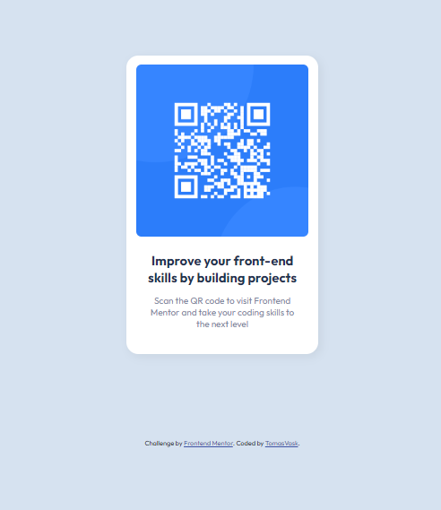

# Frontend Mentor - QR code component solution

This is a solution to the [QR code component challenge on Frontend Mentor](https://www.frontendmentor.io/challenges/qr-code-component-iux_sIO_H). Frontend Mentor challenges help you improve your coding skills by building realistic projects. 

## Table of contents

- [Overview](#overview)
  - [Screenshot](#screenshot)
- [My process](#my-process)
  - [Built with](#built-with)
  - [What I learned](#what-i-learned)
  - [Continued development](#continued-development)
  - [Useful resources](#useful-resources)
- [Author](#author)

## Overview
First challenge of frontendmentor.io - creating a QR code card.
### Screenshot



## My process

### Built with

- Semantic HTML5 markup
- Flexbox

### What I learned

Vertical alignment is still not clear. 

To see how you can add code snippets, see below:

```css
.container {
    height: 500px;
    width: 320px;
    background-color: hsl(0, 0%, 100%);
    display: flex;
    flex-flow: column wrap;
    align-items: center;
    border-radius: 20px;
    margin: 10vh auto;
    box-shadow: 5px 5px 15px 1px rgba(0, 0, 0, 0.055);
```

### Continued development

Will focus on layouts, flexbox specificities as well as positioning which I still find confusing.

### Useful resources

- [Mozilla Dev Docs](https://developer.mozilla.org/) - This is my primar source for info, but also use alternative sources

## Author

- Website - [TomasVask]
- Frontend Mentor - [@yourusername](https://www.frontendmentor.io/profile/yourusername)
